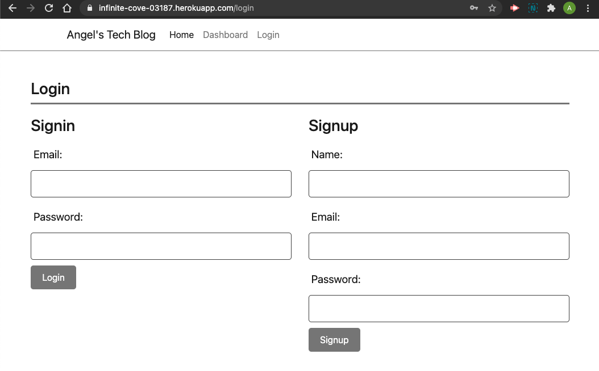
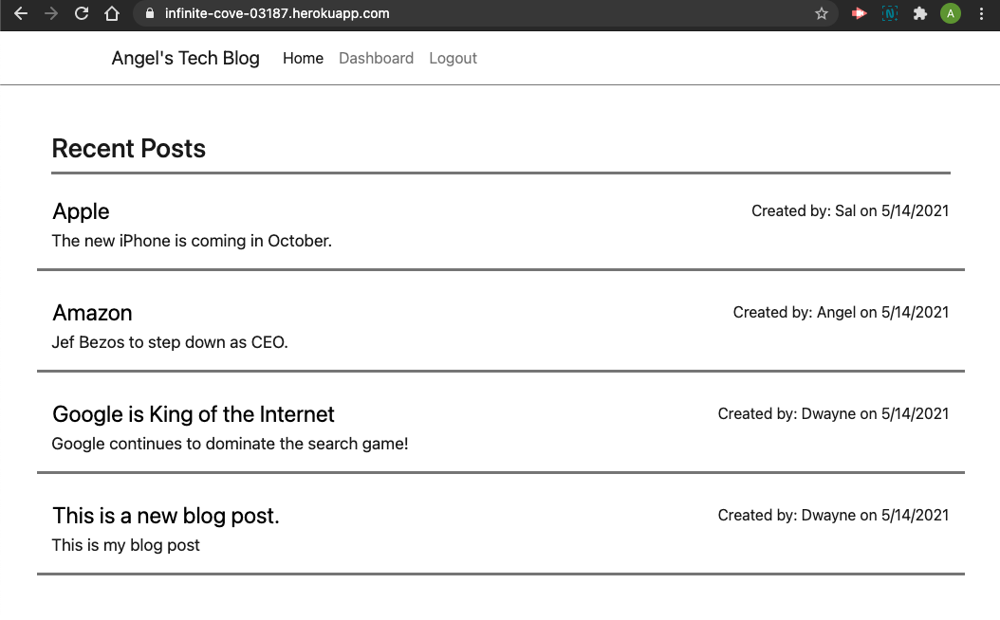
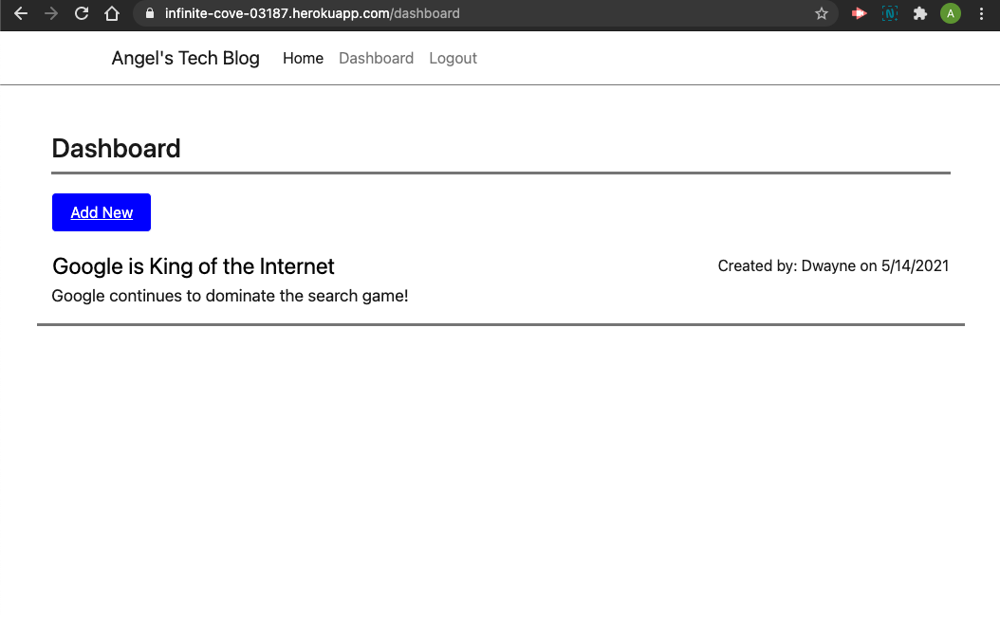
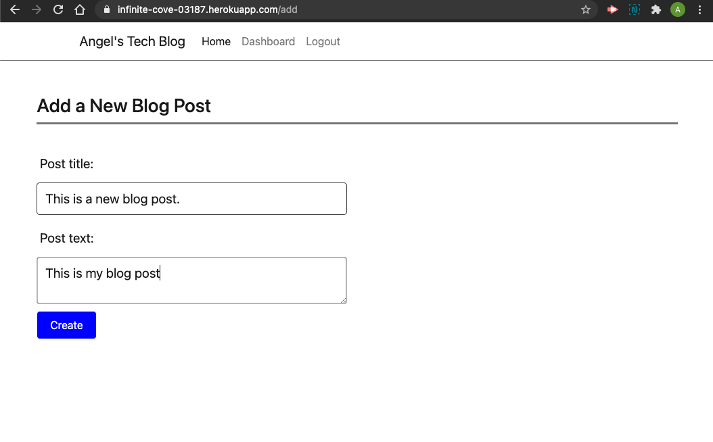
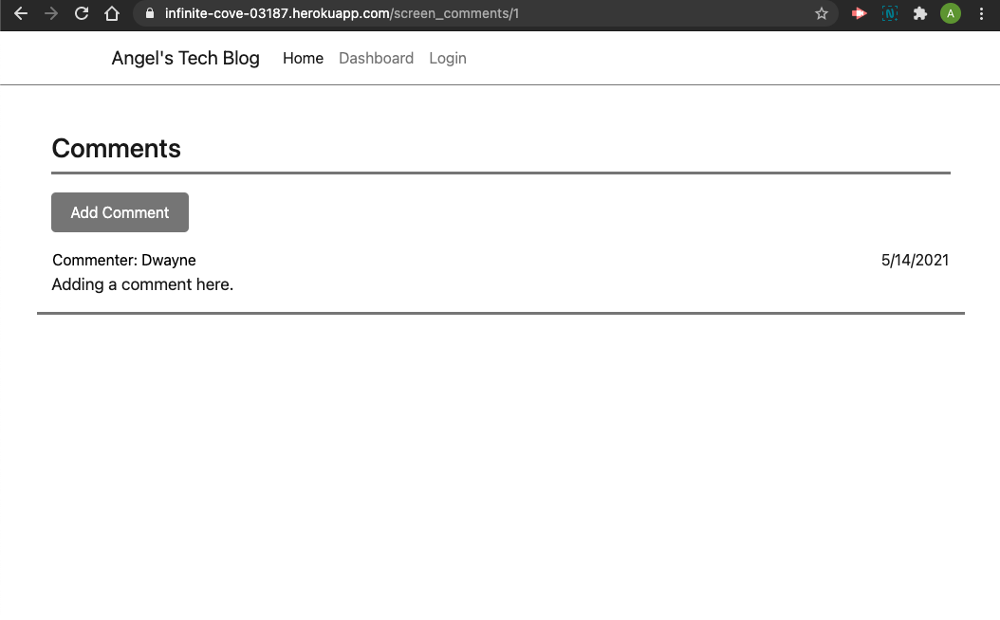

# Tech Blog

## Description
    The Tech Blog is an application built for users that love the latest
    news in technology. In this applicartion users can share the latest
    news about the latest technology and blog post about their thoughts
    and opinions. 

## Technologies
    This application was built with Node.js, Express.js for the API, 
    Handlebars as the template engine and MySQL, Sequelize for the database.

## Story
    - User arrives on the home page.
    - The user is able to see all recent blog posts.
    - If the user has an account they can log in using the login form.
    - If the user does not have an account they are able to create one by using 
      the signup form.
    - Once the user is logged in, the user is taken to the home page and now they
      are able to comment on post of other users.
    - The user also has access to the dashboard where they are able to add new posts
      as well as delete past posts. 
    - If the user wants to create a post they just go to the dashboard and click on the
      "add new" button.
    - The user can now type in a title and the main post and click the "create" button.
    - The user can also delete a post by clicking on the post and either clicking on the 
      "delete" or "update button".

## License

## Login Testing
  username: angel@gmail.com
  password: test12345

## Deployment
[The Tech Blog ](https://infinite-cove-03187.herokuapp.com/)
This app is deployed live on Heroku! (Click Link!)

## Demo

